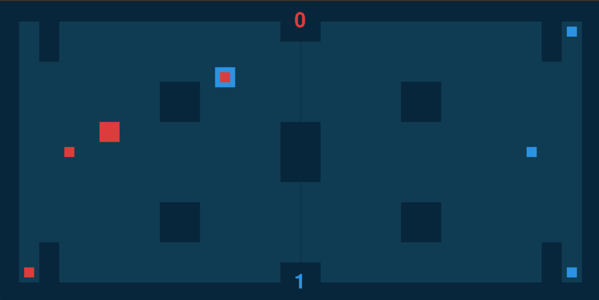
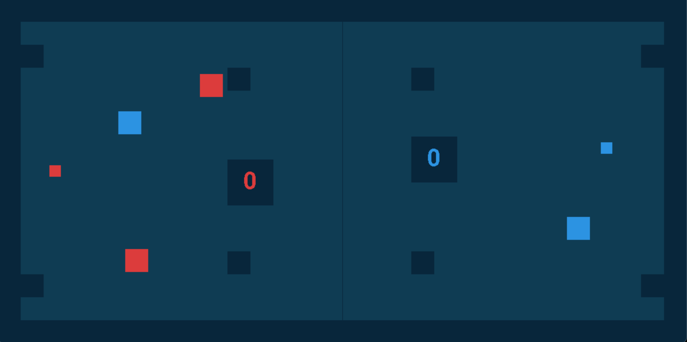
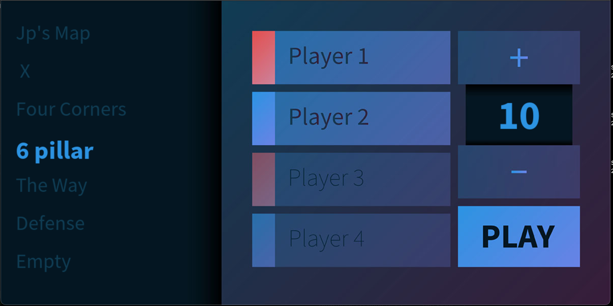
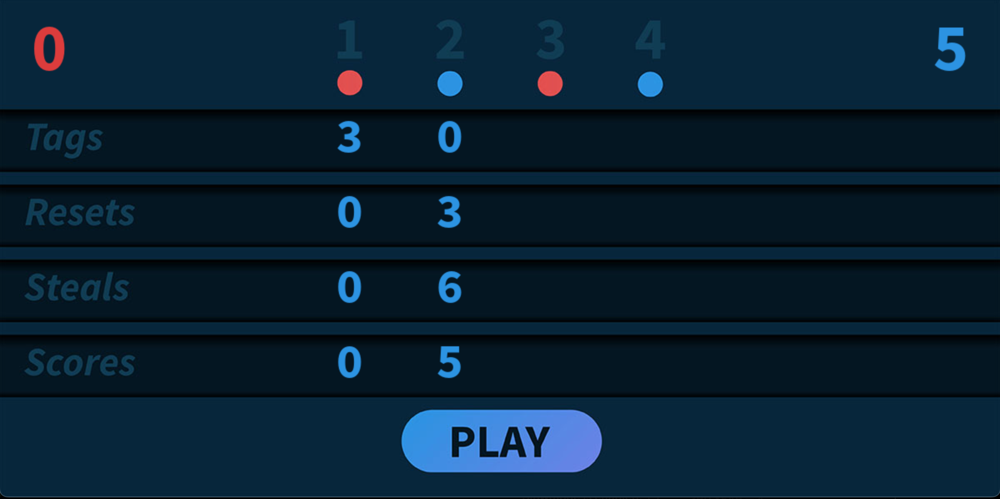

# CaptureTheFlagv4
Four player capture the flag game for up to four players. Multiple maps and play settings.

## Dependencies
Python 3,
Pygame

## Usage
Open the ctfv4.py file and run it to play the game.

## How to play
Controls for two player games are WASD, UP/DOWN/LEFT/RIGHT
Controls for additional two players are TFGH, IJKL

Use the arrow keys to capture the opposite flag and move back across the center line to score.
Tag players on your side to send them back to their spawn location.

## Home screen
Click the four player buttons to toggle which players you would like to play with.
Click the '+' and '-' buttons to select the number of points you would like to play to.
Use the UP and DOWN arrows to select the map you like to play on.

## Stats page
Once the game is over, a stats page will be displayed showing stats for each player.

## Custom maps
You can make custom maps by adding to the maps.json file.
